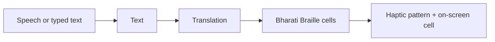
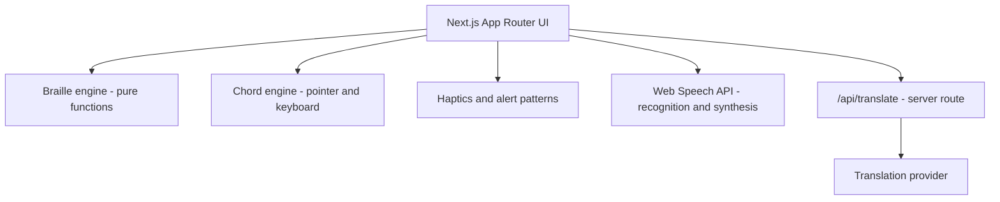
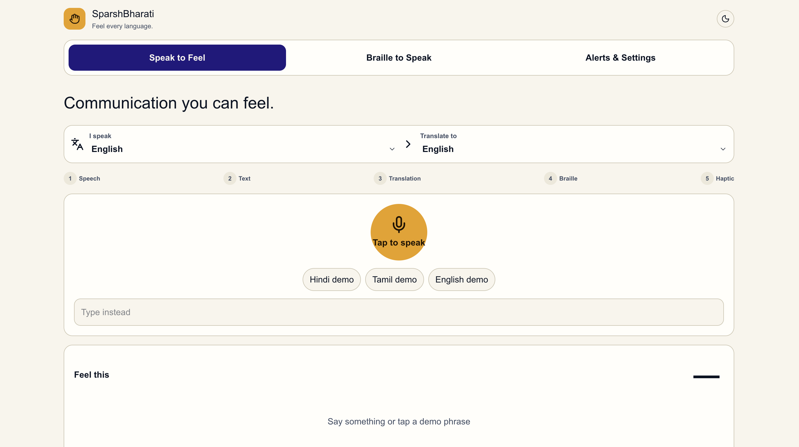
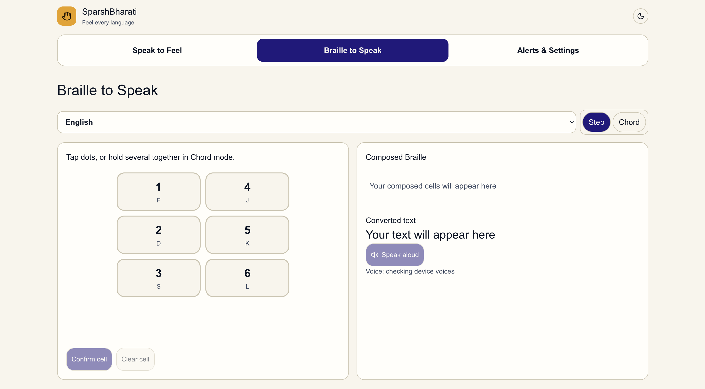
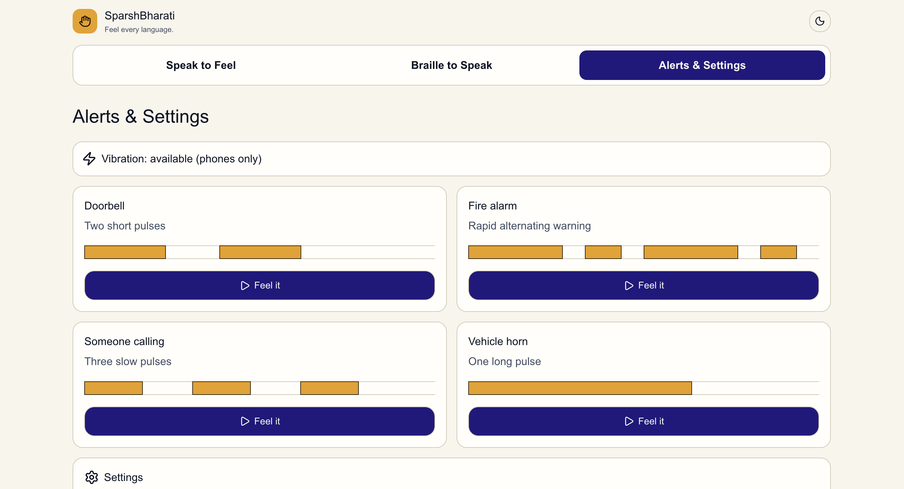

# SparshBharati: Feel Every Language

> A mobile-first web app that lets a hearing person and a DeafBlind person communicate in both directions using **Bharati Braille**, the unified Braille system for Indian languages, through touch, vibration and speech.


**Live demo:** [https://sparshbharati.vercel.app/]

**Demo video:** [https://drive.google.com/file/d/16LAX_igW9C2XvHhuMJ3qNYGbyXwY80xe/view?usp=sharing]  
**Challenge:** Accessible India

---

## 1. The problem

Deafblindness is recognised as a disability under the Rights of Persons with Disabilities (RPwD) Act, 2016. It is also one of the least served. Almost every mainstream accessibility tool assumes the person can either see or hear:

- Captions and sign-language apps need vision.
- Voice assistants and screen readers need hearing.
- Imported refreshable Braille displays cost lakhs of rupees and support few Indian languages.
- Most tools also assume one language, while India reads and writes in many.

For a DeafBlind person, touch is the only channel. Today, most day-to-day conversation depends on a trained interpreter being present.

## 2. Our solution

SparshBharati turns speech into touch, and touch back into speech, in Hindi, Tamil and English.

| Direction | What happens |
|---|---|
| **Speak to Feel** (hearing person to DeafBlind user) | Speak or type, then speech-to-text, optional translation, Bharati Braille, then **timed vibration patterns** plus an animated on-screen 6-dot cell |
| **Braille to Speak** (DeafBlind user to hearing person) | Enter Braille on a 6-key pad (tap mode, multi-touch chord mode, or physical keyboard), then text, then **spoken aloud** by the device |
| **Alerts** | Distinct haptic signatures for doorbell, fire alarm, someone calling, and vehicle horn |

## 3. Who it is for

- **DeafBlind people** who read and write Braille and want to converse without an interpreter.
- **Family members, teachers, caregivers and volunteers** who can speak but do not know Braille.
- **Special-education institutions and NGOs** that need a low-cost teaching and communication tool.

## 4. How it works

### Pipeline (Speak to Feel)



### Haptic encoding

Each Braille cell is played as **6 time slots, one per dot** (dot 1 to dot 6):

- A raised dot vibrates for about 70% of its slot, then pauses for 30%, so consecutive raised dots stay distinguishable. The Vibration API merges back-to-back pulses.
- An unraised dot is silent for the full slot.
- A longer pause separates cells.
- Default slot length is 150 ms, adjustable in Settings (slow / normal / fast).
- The animated on-screen cell plays in sync on every device, so the app is usable even where vibration is unavailable.

### Braille to Speak input modes

- **Step mode (default):** tap dots to raise or lower them, then press *Confirm cell*. Works with one finger or a mouse.
- **Chord mode:** press several keys at once like a Perkins brailler; the cell is committed when all fingers lift.
- **Physical keyboard:** `F D S` = dots 1 2 3, `J K L` = dots 4 5 6. Holding `F + D + K` and releasing gives dots 1-2-5, which is "h" in English.

## 5. Architecture



Design decisions:

- **Logic is separate from UI.** Braille mapping, chord handling, haptic pattern building and alert patterns are pure, framework-free modules, so they can be unit-tested.
- **One source of truth for alerts.** The vibration and the on-screen diagram both read from the same pattern array, so they can never disagree.
- **Translation is server-side.** API keys are never exposed to the browser. If translation is unavailable, the app continues with the original text and shows a kind message.
- **No accounts, no database, no tracking.** Nothing a user says or types is stored.

## 6. Tech stack

Next.js (App Router), TypeScript, Tailwind CSS, shadcn/ui, next-themes, Vitest and React Testing Library. Browser APIs: Web Speech API, Vibration API, Pointer Events. Deployed on Vercel.

## 7. Setup

```bash
git clone [REPO_URL]
cd [REPO_NAME]
pnpm install
cp .env.example .env.local   # optional: add a translation provider key
pnpm dev                     # http://localhost:3000
```

Environment variables (see `.env.example`):

| Variable | Purpose |
|---|---|
| `BHASHINI_API_KEY` | Optional. Used only by the server-side translate route. Never sent to the client. |

## 8. Tests and evidence of quality

```bash
pnpm test    # unit and component tests (Vitest)
pnpm build   # production build
```

**What the tests cover:**

- Braille mapping and round trips in English, Hindi and Tamil (for example `"hello"` becomes `⠓⠑⠇⠇⠕`).
- Chord engine: `F + D + K` released together gives `[1,2,5]`, sequential taps give separate cells, and `pointercancel` commits nothing.
- Keypad layout and key mapping (left column dots 1-2-3, right column dots 4-5-6).
- Haptic pattern builder: strictly alternates vibrate and pause, with correct total duration.
- Alert patterns: pulse counts and proportional diagram widths.
- Voice selection: exact match, language-prefix match, and fallback.

**Error states (each with a message and a recovery action):** microphone permission denied, speech recognition unsupported, translation offline or failed, vibration unavailable, speech synthesis unavailable or no voice for the language, empty input, and unsupported Braille character (shown as a visible `?` cell).

**Accessibility:** semantic HTML, `aria-live` announcements ("Listening", "Playing cell 3 of 12", "Speaking"), visible focus rings, full keyboard operation, minimum 48 px tap targets (80 px for keypad keys), `prefers-reduced-motion` respected, raised and unraised dots differ by fill and border and never by colour alone, light/dark themes and a high-contrast mode.

**Security basics:** API keys are read only on the server, `.env*` files are git-ignored (only `.env.example` is committed), and user input is validated in the translate route. `pnpm audit` reports upstream advisories in transitive dev dependencies of the UI toolkit. No application secret is committed.

## 9. Screenshots

| Speak to Feel | Braille to Speak | Alerts |
|---|---|---|
|  |  |  |

## 10. Measurable impact

- **Cost:** imported refreshable Braille displays cost lakhs of rupees. Our software layer is free to use in a browser, and the planned 6-motor wearable has a target build cost under ₹2,500 (an estimate, not yet built).
- **Languages:** 3 languages (Hindi, Tamil, English) on one shared Braille encoding.
- **Reach:** no install and no account. It runs in a mobile browser and can be added to the home screen as a PWA.
- **Latency and reading speed:** [ADD MEASURED VALUES IF YOU HAVE THEM, e.g. speech-to-first-vibration delay in ms, cells per minute at the default speed].

## 11. AI-use declaration

| Tool | What it helped with |
|---|---|
| Claude (Anthropic) | Project ideation and scoping, prompt writing, debugging guidance, code review, documentation drafts |
| v0 by Vercel | Generated the Next.js / TypeScript / Tailwind code, tests and initial documentation from our prompts |

**What we personally verified:** see [`AI_USE.md`](AI_USE.md) for the full list, including how we verified the Braille mappings against [SOURCE], the chord input, the vibration patterns on an Android phone, and that no secrets are in the repository.

## 12. Known limitations

- A phone has **one vibration motor**, so only one dot can be felt at a time. This app is the software layer that proves the encoding and communication flow for a future six-motor wearable.
- **Not yet validated with DeafBlind users.** Feedback from users and institutions is the next step.
- **Vibration** works in Chrome on Android. iPhones and desktop browsers do not vibrate, so the app shows each pulse on screen instead.
- **Voice availability depends on the device.** Hindi and Tamil text-to-speech voices must be installed on the phone. If none is found, the app says so and falls back to another voice.
- **Translation** needs a network connection. If it is unavailable, the app continues with the original text.
- **Multi-touch chord input** needs a touchscreen that supports several simultaneous touches. Step mode is the fallback.
- Screen readers such as TalkBack intercept touch gestures, so a web app cannot fully match a system Braille keyboard.

## 13. Roadmap

1. Pilot with a school or institution for the deafblind, and collect real user feedback.
2. Build the low-cost six-motor wearable band (wrist band or finger ring) driven over Bluetooth Low Energy, so all six dots are felt at once.
3. Pair with Bluetooth Braille keyboards and refreshable displays.
4. Add more Indian languages and contracted Braille.
5. Add an open haptic-timing standard and a per-user speed calibration.
6. Offline mode with on-device speech and translation.

## 14. Team

- Shivangi Kakkar (https://github.com/Shivangi-projects)
- Sanchi Goyal.   (https://github.com/sanzzzz-g)

