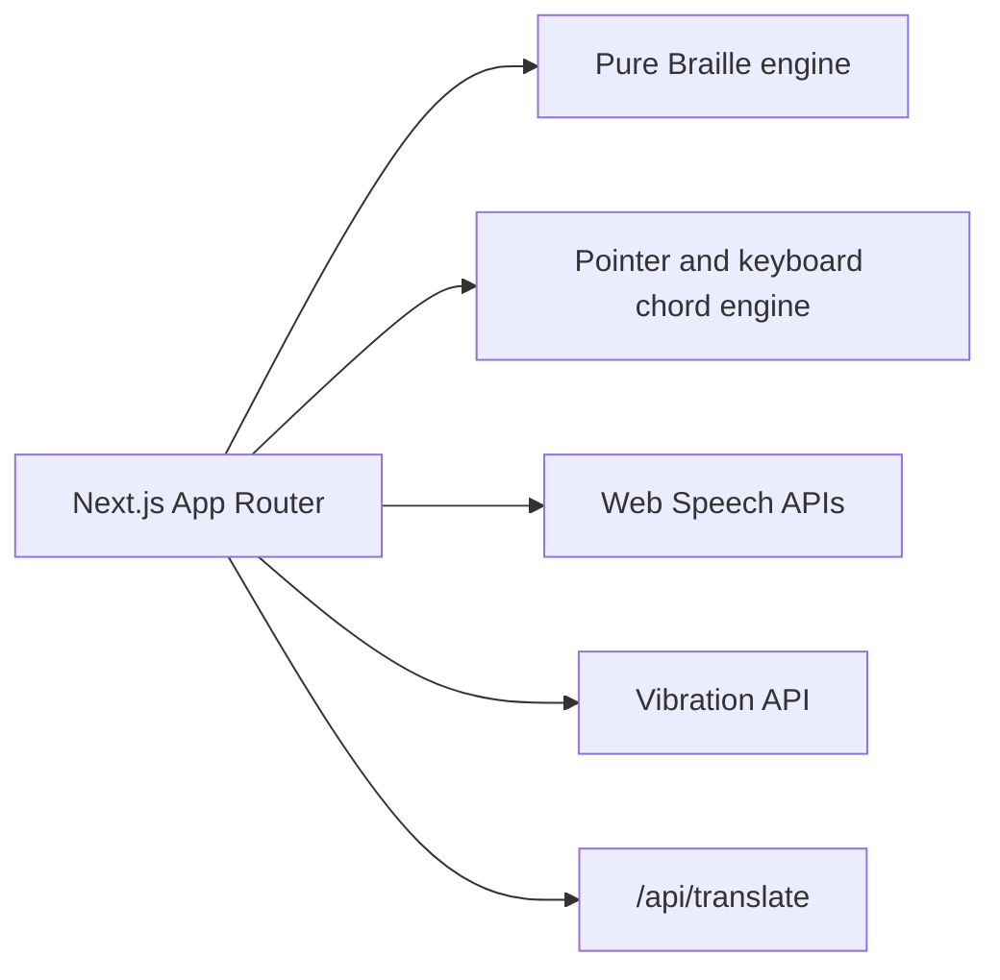

# SparshBharati

SparshBharati is a mobile-first accessibility prototype for communication between hearing people and DeafBlind people using Bharati Braille, speech, visual cells, and timed haptic patterns.

## Architecture

## Setup

Install dependencies with `pnpm install`, then start with `pnpm dev`. Add `BHASHINI_API_KEY` only when connecting a translation provider; the current server route safely falls back to the original text.

## Tests

Run `pnpm test` for Vitest and `pnpm build` for the production build.

## Screenshots

- [ ] 390x844 light
- [ ] 390x844 dark
- [ ] 1280x800 light
- [ ] 1280x800 dark

## Known limitations

Phones expose one vibration motor, so this demonstrates the software layer for a future six-motor wearable. It is not yet validated with DeafBlind users. Voice availability, microphone recognition, and browser vibration vary by device. Indic matras, halants, conjuncts, and Tamil uyirmei mappings require official chart verification.

## Roadmap

Six-motor wearable band; Bluetooth Braille display pairing; validation with DeafBlind users; official Bharati Braille verification.
